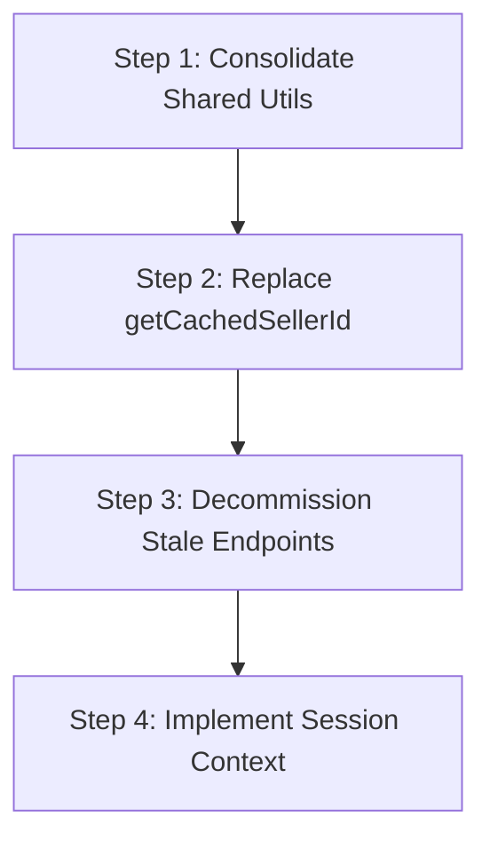

# Codebase Optimization & Cleanup Plan

This document outlines redundant helpers, duplicated code patterns, stale Wix endpoints, and unused structures identified during the QA audit. It defines a safe cleanup execution order to streamline the application's data layer without breaking existing page flows.

---

## 1. Unused / Redundant Functions
- **`getCachedSellerId()`** (defined in `src/services/sellerService.js` at line 537): A duplicated lookup implementation reading storage keys directly. This is redundant since `resolveSellerId` in `src/utils/sellerSession.js` is the centralized resolver.
- **`resolveWixImage()`** duplication: This helper is identical but declared in two places:
  1. `src/services/sellerService.js`
  2. `src/pages/Inventory/hooks/useInventoryViewModel.js`

---

## 2. Duplicate `sellerId` Lookups
- **Independent Layout & Page Mount Checks**: 
  - Both `DashboardLayout.js` and every single nested child route page (e.g. `DashboardPage.js`, `Sidebar.js`, `InventoryPage.js`, `WalletPage.js`) read and evaluate `sellerId` or `sellerEmail` independently on initial mount.
  - **Proposed Solution**: Introduce a centralized `<SellerSessionProvider>` context wrapping the layout, exposing a unified `sellerId`, `email`, and a `sessionReady` flag to child routes.

---

## 3. Duplicate API Wrappers & Stale Endpoints
- **Stale Referral Endpoints**:
  - Old code references to `sellerReferralcode` (which returns a 404 from the backend Wix functions) should be marked for removal. 
  - Only the verified `referralCheck` and `sellerreferral` API endpoints should remain.
- **`activeCoupons` vs `referralCheck`**:
  - `activeCoupons` is used elsewhere for returning marketing/advertising banner image definitions, but was previously conflated with coupon codes. These wrappers should be strictly separated.

---

## 4. Recommended Cleanup Order

To minimize regression risks, codebase cleaning should be performed in the following sequence:

1. **Step 1: Consolidate Shared Utils**
   - Extract `resolveWixImage` into a common utility module (e.g. `src/utils/image.js`) and import it in both `sellerService.js` and the inventory view model.
2. **Step 2: Replace `getCachedSellerId`**
   - Replace all usages of `getCachedSellerId` in `sellerService.js` with calls to `resolveSellerId` from `src/utils/sellerSession.js`, then safely remove the redundant definition.
3. **Step 3: Decommission Stale Endpoints**
   - Remove unused API wrappers mapping to dead endpoints (like `sellerReferralcode`).
4. **Step 4: Implement Session Context**
   - Refactor `DashboardLayout` to expose session state via a React Context provider, eliminating redundant storage scans in pages and sidebar layouts.
